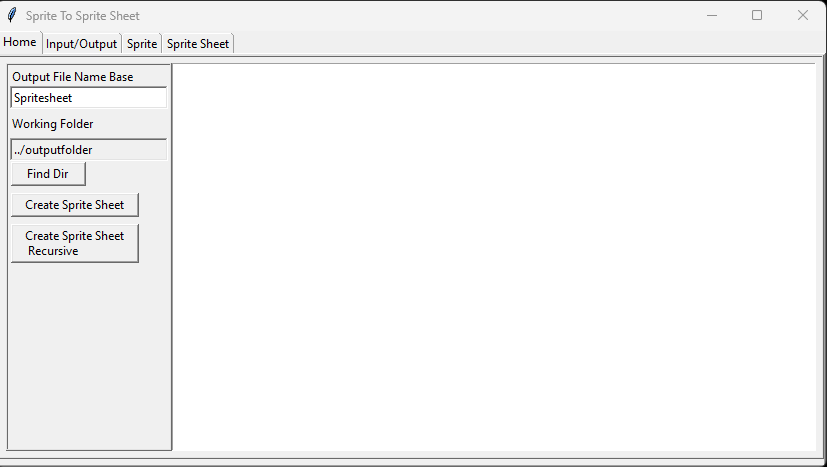

# Phil Plachta's Game Dev Portfolio

  

 

# Table Of Contents
> - [Introduction](#main-introduction)
> - [Primary Project & Prototypes](#primary-project)
>    - [Screen Shots](#primary-project-screen-shots)
> - [Completed Tutorials & Related Projects](#completed-tutorials-section)
>    - [Screen Shots](#tutorial-projects-screen-shots)
<!-- > - [Links](#links) -->
 

## Introduction
> I am a skilled software developer with a bachelor’s degree in computer science from Michigan State University and 10 years of experience, focusing on web development. For the past five years I have been working remotely at an IoT start-up where I am responsible for developing and maintaining the company’s software and server infrastructure. I have dedicated the last 14 months of nights and weekends to touch, understand, and implement as many aspects of game development as possible.

<!--  
 

## Links
> - LinkedIn
> - Sprite To Spritesheet Repo
> - XtraBackupAutomator Repo
> - 
 -->
 
 

 

# Primary Project & Prototypes
> 'UO:Defender 2', a tower defense, has been my primary project and guide in learning. Written in C# using the Godot Engine, this is my third iteration of the same idea.
> The progress I have made can been seen from prototype 1, to 2, to the current version that exists today. My only goal in creating this project is to learn, and I have learned a lot so far!

 

- ## UO:Defender 2 (Main project) - <b>[Screen Shots](#primary-project-screen-shots)</b> - <a href="PrimaryProjects/UODefender2D_CurrentVersion/src" target="_blank">Code</a> - <b><a href="https://www.youtube.com/watch?v=rc0TPBeNXVY" target="_blank">YouTube</a></b>
> 
>
> - Worked on ___05/08/2024 to Present___
>   - <b><a href="PrimaryProjects/UODefender2D_CurrentVersion/src" target="_blank">UO:Defender 2 Code</a> </b>
>   - <b><a href="https://www.youtube.com/watch?v=rc0TPBeNXVY" target="_blank">GamePlay Video (YouTube)</a></b>
> - Details
>   - This work in progress is a 2D Tower Defense game, written in C# using the Godot engine.
>   - I was able to put together a lot of what I had learned from tutorials as well as from the previous two prototypes to approach this design thoughtfully. This work in progress has been an excellent teacher.
> - ___[Screen Shots & Features](#primary-project-screen-shots)___

 

- ## UODefender Prototype 2 - <b>[Screen Shots](#primary-proto-2-screen-shots) - <a href="PrimaryProjects/UODefender_PrototypeTwo/src" target="_blank">Code</a></b>
>  
>
>  - Worked on ___02/12/2024 to 05/08/2024___
>    - <b><a href="PrimaryProjects/UODefender_PrototypeTwo/src" target="_blank">Prototype 2 Code</a> </b>
>    - <b>[Screen Shots](#primary-proto-2-screen-shots)</b>
>  - Details
>    - Abandoned when I realized making the art look good in 3D was not worth it. I was pushing for 3D because I felt I would learn more math, but not having to create my own art was invaluable to me. 
>    - This project let me experiment with building many basic systems such as mobiles, attacks, and navigation. Much of this thought-work influenced the current version of the project.

 

- ## UODefender Prototype 1 - <b><a href="PrimaryProjects/UODefender_PrototypeOne/Scenes" target="_blank">Code</a> - [Screen Shots](#primary-proto-1-screen-shots)</b>
>  
>
>  - Worked on ___01/12/2024 to 02/12/2024___
>    - <b><a href="PrimaryProjects/UODefender_PrototypeOne/Scenes" target="_blank">Prototype 1 Code</a></b>
>    - <b>[Screen Shots](#primary-proto-1-screen-shots)</b>
>  - Details
>    - Used as proof of concept to show to myself that I could utilize what I learned to create the type of game that I wanted. 3D attempt, written in GDScript. 

 

- ## Sprite To Sprite Sheet (Art Pipeline) - <a href="https://github.com/phildoesdev/SpriteToSpriteSheet/tree/main/pythonProject/src" target="_blank">Code</a>
> 
 

>
>  - <a href="https://github.com/phildoesdev/SpriteToSpriteSheet" target="_blank">Sprite To Sprite Sheet Repo Link</a>
>  - Details
>    - A custom piece of software written in Python to convert images to sprite sheets
>    - A crucial piece of my art pipeline in getting art from UO to animated in my project!

 

 

# Completed Tutorials & Related Projects
> This is a list of significant tutorials and related projects that I have completed since the beginning of my game dev journey (~12/01/2023).

 

- ## The Ultimate Introduction to Godot 4 - [Code](TutorialRelatedProjects/2DBugShooter/scenes) - [Screen Shots](#intro-to-godot-4)
> 
 

> 
>  - <b>11 Hours</b> - <a href="https://www.youtube.com/watch?v=nAh_Kx5Zh5Q" target="_blank">YouTube Tutorial Link</a>
>  - Completed 01/11/24 
>    - [2D Bug Shooter Code](TutorialRelatedProjects/2DBugShooter/scenes) - [Screen Shots](#intro-to-godot-4)
>  - Covered
>    - Introduction to concepts of 2D game design, and the Godot Game Engine

- ## Complete Godot 3D: Code Your Own 3D Games In Godot 4! - ([Screen Shots](#complete-godot-3d-projects))
> 
 

>
>  - <b>20 Hours</b> - <a href="https://www.gamedev.tv/courses/godot-complete-3d/welcome-to-the-course/5727" target="_blank">GameDev.TV Tutorial Link</a>
>  - Completed 01/24/24 
>    - <b><a href="TutorialRelatedProjects/ProjectBoost" target="_blank">Project Boost Code</a> - [Screen Shots](#proj-boost)</b>
>    - <b><a href="TutorialRelatedProjects/Barbarian_Blaster" target="_blank">Barbarian Blaster Code</a> - [Screen Shots](#barbarian-blaster)</b>
>    - <b><a href="TutorialRelatedProjects/Robo%20Rampage" target="_blank">Robo Rampage Code</a> - [Screen Shots](#robo-rampage)</b>
>  - Covered
>    - Introduction to concepts of 3D game design, further exploring the Godot Game Engine API
>    - Utilized the engine to implement basic game building blocks such as movement, collision, and progression
>    - Worked with 3D meshes, collisions, navigation, and other 3D concepts

- ## Math for Video Games: Builder Better Games Faster with Advanced Game Math
>  - <b>18 Hours</b> - <a href="https://www.gamedev.tv/courses/math-for-games/welcome-to-the-course/3195" target="_blank">GameDev.TV Tutorial Link</a> 
>  - Completed 03/27/24
>  - Covered
>    - Exposed me to a variety of topics as well as let me go back and reestablish some older knowledge
>    - The course covered trigonometry, vector math, matrix math, rotation & interpolation, math with polar coords, complex #s, quaternions, and basic statistics
>    - This tutorial let me think deeply about math topics that I felt weak in. This was a very valuable course for me.

- ## Godot 4 Shaders - [Code](TutorialRelatedProjects/CommonTechniques/shaders) - [Screen Shots](#godot-shaders)
>  - <b>4 Hours</b> - <a href="https://www.gamedev.tv/courses/godot-shaders/course-overview/6054" target="_blank">GameDev.TV Tutorial Link</a> 
>  - Completed 07/17/24
>    - [Code For Common Techniques](TutorialRelatedProjects/CommonTechniques/shaders) - [Screen Shots](#godot-shaders)
>  - Covered
>    - The basics of shaders, and several 'recipes' to create cool effects, such as using noise images to create interesting visual effects
>    - I was able to immediately incorporate the skills that I learned in this course into my tower defense game!
 

  

# ___Screen Shots & Gifs___

 

<h1>Primary Projects <a href="#primary-project">Back</a></h1>

 
 

## UO:Defender 2 (Main project) - <b><a href="PrimaryProjects/UODefender2D_CurrentVersion/src" target="_blank">Code</a> - [Screen Shots](#primary-project-screen-shots)</b> - <b><a href="https://www.youtube.com/watch?v=rc0TPBeNXVY" target="_blank">YouTube</a></b>

- ### Gameplay GIF
>
> Click To Play Gif !!  
> 
  

> Click To Play Gif !!  
> 
  

- ### Expandable Mobile Base Class
>
> The thoughtful design of my [Mobile](PrimaryProjects/UODefender2D_CurrentVersion/src/Scenes/Mobiles/Mobile.cs) class and its [surrounding features](PrimaryProjects/UODefender2D_CurrentVersion/src/Scenes/Mobiles) have made [creating mobiles](PrimaryProjects/UODefender2D_CurrentVersion/src/Scenes/Mobiles/Towers/Archer.cs) and allowing them to interact throughout the system incredibly intuitive and straight forward! 
>
> 
>   
> Which has enabled me to easily create, clothe, animate, and program new attacks for several towers
> 

- ### A Dynamic Attack Base Class
>
> A powerful and dynamic [base attack](PrimaryProjects/UODefender2D_CurrentVersion/src/Scenes/Abilities/Attacks/BaseAttack.cs) class connects into hooks throughout the code base to allow for its inheritors to be very [simple attacks](PrimaryProjects/UODefender2D_CurrentVersion/src/Scenes/Abilities/Attacks/PugilistsGloves.cs), or more [complex attacks](PrimaryProjects/UODefender2D_CurrentVersion/src/Scenes/Abilities/Attacks/TempestsBoltAttack.cs) with [projectiles](PrimaryProjects/UODefender2D_CurrentVersion/src/Scenes/Abilities/Projectiles/BaseProjectile.cs).
>
> 

- ### Custom Animation Player Allows for plug-and-play use of any UO mobile animated art, and of any UO hue.
>
> My custom animation player allows me to interact with sprite sheets in a robust, and expandable way. The [AnimationPlayer](PrimaryProjects/UODefender2D_CurrentVersion/src/Scenes/Mobiles/Animation/MobileAnimationPlayer.cs) utilizes [Animated Sprites](PrimaryProjects/UODefender2D_CurrentVersion/src/Scenes/Mobiles/Animation/AnimatedSprite.cs) to play animations defined by the [AnimationDefinitionLibrary](PrimaryProjects/UODefender2D_CurrentVersion/src/Scenes/Mobiles/Animation/AnimationDefinitionLibrary.cs), all in service of animating each [Mobile](PrimaryProjects/UODefender2D_CurrentVersion/src/Scenes/Mobiles/Mobile.cs) 

- ### Plus much, much more
> - Plus many more partially implemented systems that work but are not implemented as full game features such as the [XP and Leveling System](PrimaryProjects/UODefender2D_CurrentVersion/src/Scenes/Leveling/XPManager.cs), and [spawn series with difficulty curves](PrimaryProjects/UODefender2D_CurrentVersion/src/Scenes/EnemyMgmt/EnemySpawnSeries) for creating enemy spawns!
> - And also, features that are implemented, but have so much room to grow like the [intelligence FSM](PrimaryProjects/UODefender2D_CurrentVersion/src/Scenes/Mobiles/Intelligence/BaseIntelligence.cs), more [buildings](PrimaryProjects/UODefender2D_CurrentVersion/src/Scenes/Structures) with complex behaviors, and many more.

- ### More Screen Shots & Gifs
> - [_ReadMEAssets/UODefenderGifs/UODefender2](_ReadMEAssets/UODefenderGifs/UODefender2)

 

 

# Prototype 2 - <a href="PrimaryProjects/UODefender_PrototypeTwo/src" target="_blank">Code</a>
> Prototype 2 was created to continue down the path of creating something to teach myself. It was abandoned because making the UO art work in 3D space was a fools errand, but I learned so much getting to that point that this was valuable time spent.
>

- ### Gameplay GIF
>
> Click To Play Gif !!

  

- ### Screen Shots

  

 

 

## Prototype 1 - <a href="PrimaryProjects/UODefender_PrototypeOne/Scenes" target="_blank">Code</a>
> Created as a proof of concept for some basic ideas. This is my 'is this possible' prototype.
> 

- ### Gameplay GIF
>
> Click To Play Gif !!  

  

- ### Screen Shots

  

 
 
 
 
 
 
 

 
 
 

<h1>"The Ultimate Introduction to Godot 4" Tutorial <a href="#completed-tutorials">- (Back)</a></h1>

- ## 2D Bug Shooter - [Code](TutorialRelatedProjects/2DBugShooter/scenes)
> A game with multiple enemies, health and ammo pickups, scene transitions, music and sound effects, animations, and many other basic game components.
> My first major introduction into game development
> 
 

> 
> ## 2D Bug Shooter Gif
>
> Click To Play Gif !!
> 

 
 

 
 

<h1>"Complete Godot 3D Projects" Tutorial <a href="#completed-tutorials">- (Back)</a></h1>

- ## Project Boost - [Code](TutorialRelatedProjects/ProjectBoost)
> Explored creating, moving, and colliding 3D objects
> 

> 
> ## Project Boost Gif 
>
> Click To Play Gif !!
> 
 
 
  

- ## Barbarian Blaster - [Code](TutorialRelatedProjects/Barbarian_Blaster)
> Explored pathing, win and lose states, rigid bodies, projetciles, and collisions
> 

> 
> ## Barbarian Blaster Gif 
>
> Click To Play Gif !!
> 
 
 
  

- ## Robo Rampage - [Code](TutorialRelatedProjects/Robo%20Rampage)
> A 3D FPS where I implemented enemies that pursue the player through the level and can be killed with a weapon. I worked with 3D meshes, collisions, navigation, and other 3D concepts
> 

>
> ## Robo Rampage Gif
>
> Click To Play Gif !!
> 
 
 
 
  

<h1>"Godot 4 Shader Projects" Tutorial <a href="#completed-tutorials">Back</a></h1>

> These courses gave me the tools to build features in my main project like a dynamic progress bar colorized by a shader and several shader animated backgrounds
- ## Common Techniques - [Code](TutorialRelatedProjects/CommonTechniques/shaders)
> 

> 
> ## Background Made Using Generated Noise and Other Math Gif
>
> Click To Play Gif !!
> 

